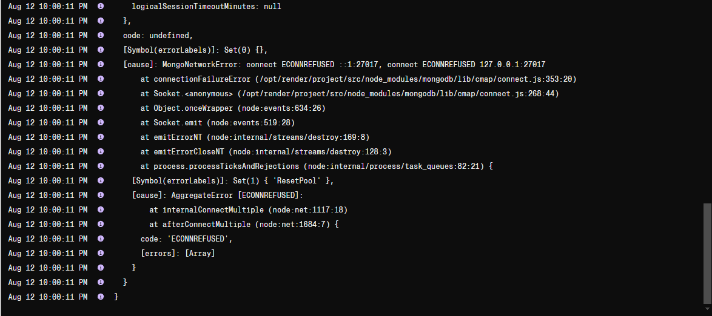
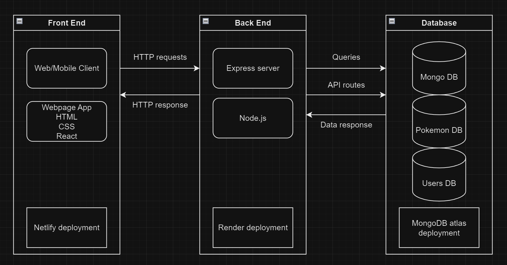

# T3A2-B - Pokemon Lootbox (Fullstack app)

The website has been deployed and closely resembles the wireframes which i had planned initally. 
There are some minor changes/additions in the current deployment which differ slightly from the planning phase.

Functions and features being worked on and not yet complete:

- User Authentication with JWT
- Inventory page
- Top up feature
- Pity system for rolling

The website is still fully functional as tested.

Register and Login is functional with simple error handling applied. 
When you register a new account, simply enter in the fields for example:

Username: Steve
Password: 11111

Username and password are both case-sensitive.

Note: There is no authentication in the user and password forms so security is very weak.

Attached below are images of the pages/components of the website

### Login and registration forms
Simple forms to register and login to use the app
!
[alt text](../docs/registration.png)

### Homepage after logging in
Screenshot is as displayed - Widescreen 34" screen

### Header and footer components
Simple navbar links and footer message visible to user audience

### About page
How to use the App and extra information

### Lootbox page & Open 1 or 5 boxes
Omitted the Popup window event mentioned in planning to display on the page 

### Dev message for sections of website not completed
This was not included in the planning stage, but I added this with intention for the reason i could not complete parts of the website mentioned in planning

With the dev message and footer message components, I can visibly explain the state the app is in.
This gives users the expectation of new features being developed within the app.
The "About page" supports this as it mentions the first deployment to be a "version 0.1.0" with improved development in later versions.

# Render Deployment issues
Attempts to deploy to render is live but still failing to connect to MongoDB

## Trello
Trello planning on the day of submission

_________________________________________________________________________________

# T3A2-A - Pokemon Lootbox (Planning) 

#### Description of App

The lootbox is essentially a rewarding system which uses RNG (Random number generator) to obtain collectables depending on the rarity. In this app, the context for the collectables will be 1st generation Pokemon (150 in total) with varying rarity tiers:

- Common = 80%
- Rare = 19%
- Legendary = 1%

The percentage value indicates the probability of obtaining a Pokemon within that tier. Every Pokemon obtained from the lootbox will be stored within uniquely to each user account.

#### Purpose

A game company wants to implement virtual collectable items obtained by opening a lootbox in the game in exchange for real world currency (this app will only use virtual currency as a sample).

This feature allows users to have a chance of obtaining rare collectables and store them in their own accounts. The idea of spending currency for virtual collectables is trending in many online games and the companies offering this system may gain profits depending on the popularity of the game.

#### Functionality / features

- User registration and login
- User authentication
- Each user is unique and has their own obtained collectables
- User can obtain more points with a top-up feature (this app will use virtual currency with infinite points)
- User can open one or multiple lootboxes at a time.
- A pity system that guarantees higher tier collectables (ex. guaranteed legendary after 100 openings.)

#### Ideas for later versions of the app

- Duplicates of items obtained can be sold for points/rerolls
- Duplicates of items can be merged to upgrade rarity tier
- Later generations of Pokemon to be added
- Lootbox offering items other than pokemon

#### Target Audience

The target audience would be the users/players of the current game. The player base is divided by terms known as F2P (Free to Play) and P2P/P2W (Pay to Play/Pay to Win). 

- F2P - Users that play the game for fun and obtain points to open lootboxes without using real currency.
- P2P/P2W - Users that play the game for fun and spend real currency for lootboxes to have an advantage over other users.

This app would mainly be directed to the P2P/P2W user audience as they would be considered as regular customers purchasing a service from the company.

#### Tech Stack

MERN stack:

- MongoDB
- ExpressJS
- React
- Node

## Dataflow Diagram

## Application Architecture Diagram

## Wireframes for Desktop and Mobile screen sizes

Wireframes made using https://app.uizard.io/

### Login and Homepage - Desktop

A simple design for the input login screen and homepage after successful login. Register button is visible for first time users of the app. After successful login a menu will be displayed on the user homepage

### Account top up page to get points

The top up page for users to purchase points for currency. (This app will be generous and offer the points to the user without purchasing). 
As the currency offers increase, it is noticeable that bonus points are also given. This is to incite users to spend more to get a little extra.

### Account Inventory page - Desktop 

Displays the users account inventory for existing pokemon obtained from lootboxes

### Lootbox page and pop-up events for opening lootbox - Desktop

Open lootbox screen and options for single or multiple lootbox openings. When prompted a pop-up screen will display the rewards. User will need to close the popup screen to open the lootboxes from the page.

 
 
 

## User Stories

As a user player, I want to purchase credits with real currency so that I can open lootboxes for a chance to obtain legendary Pokemon.

Acceptance Criteria:
- Display available lootbox options.
- Display current balances of in-game currency.
- Provide a confirmation screen before completing a purchase to prevent accidental transactions.

As a user player, I want to open a lootbox to reveal the Pokemon inside.

Acceptance Criteria:
- Show the obtained rewards clearly.
- Show distinguished effects upon receiving higher tiered Pokemon.

As a user player, I want to view my inventory of all the Pokemon I have received from lootboxes.

Acceptance Criteria:
- Display a grid view of all Pokemon.
- Provide a filtering system to sort Pokemon by rarity/type.

As a developer for this app, I want to conduct thorough testing to find and fix bugs in the lootbox system.

Acceptance Criteria:
- Create tests covering different scenarios like normal operations and error handling.
- Use testing tools to automate tests and prevent new issues.

## Trello Screenshots

As i am working on this project solo, the Trello board created is not used to its full potential as cards can be distributed and allocated to team members of a project.
In this case i used Trello to apply some organization aspects for myself. I have set the tasks, priorities, and color codes to distinguish seperate projects (Part A, Part B, etc).

